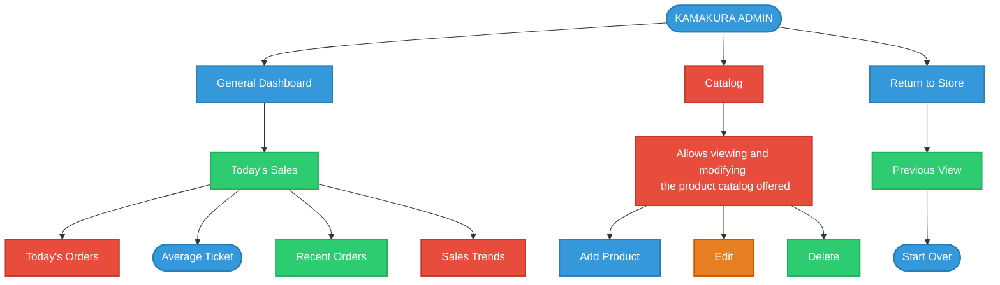

# Kamakura Admin - Architecture Flowchart

This document contains the English translation of the Kamakura Admin flowchart. You can view the diagram below, and since this is a Markdown (`.md`) file, you can easily download it, share it, or convert it to PDF using any standard editor like Visual Studio Code.

## Flowchart Diagram

## Text Breakdown (English Translation)

1. **KAMAKURA ADMIN**
   - **General Dashboard** (*Panel General*)
     - **Today's Sales** (*Ventas del dia*)
       - **Today's Orders** (*Pedidos de hoy*)
       - **Average Ticket** (*Ticket medio*)
       - **Recent Orders** (*Pedidos Recientes*)
       - **Sales Trends** (*Tendencias de ventas*)
   
   - **Catalog** (*Catálogo*)
     - **Allows viewing and modifying the product catalog offered** (*Permite visualizar y modificar el catálogo de productos que ofrecen*)
       - **Add Product** (*Añadir producto*)
       - **Edit** (*Editar*)
       - **Delete** (*Eliminar*)
       
   - **Return to Store** (*Volver a la tienda*)
     - **Previous View** (*Vista anterior*)
       - **Start Over** (*Vuelve a empezar*)
